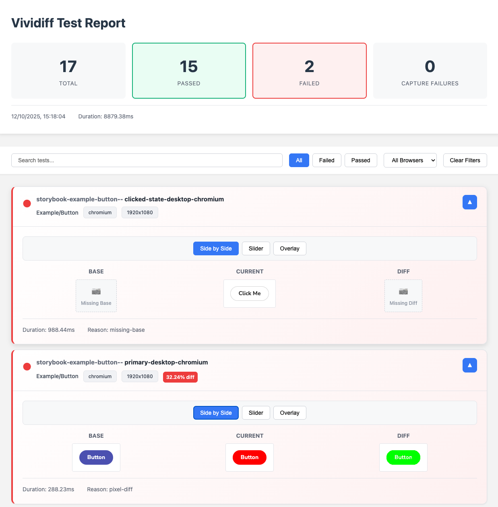

# ViSnap

A visual regression testing tool for Storybook 8+ that captures and compares screenshots of your components.

## Key Features

- **CLI Interface** - Simple commands for init, test, and update operations
- **Storybook Integration** - Test individual stories with precision
- **URL Testing** - Test any web page or application without Storybook
- **Multi-Browser Support** - Test across Chromium, Firefox, and WebKit
- **Multiple Viewports** - Test across desktop, tablet, and mobile screen sizes
- **Interactive Testing** - Execute 20+ user interactions before capturing screenshots
- **Docker Support** - Run tests in isolated containers for consistent results
- **CSS Injection** - Disable animations and hide elements for stable screenshots
- **Dual Comparison Engines** - Choose between `odiff` and `pixelmatch` for image comparison
- **Flexible Filtering** - Run specific stories or exclude unwanted ones with minimatch patterns
- **Concurrent Processing** - Parallel test execution with configurable concurrency
- **TypeScript Support** - Full type safety with shared protocol types
- **Configuration Management** - TypeScript/JavaScript config files with validation
- **Comprehensive Reporting** - Generate both JSON and interactive HTML reports

<table align="center">
  <tr>
    <td align="center">
      
    </td>
  </tr>
</table>

## Quick Start

Install and run:

```bash
# Install globally
npm install -g visnap

# Or use with npx (no installation needed)
npx visnap init
npx visnap update
npx visnap test
```

## Basic Usage

1. **Initialize** in your Storybook project:
   ```bash
   npx visnap init
   ```

2. **Create baseline** screenshots:
   ```bash
   npx visnap update
   ```

3. **Run tests** on changes:
   ```bash
   npx visnap test
   ```

Screenshots are saved to the `visnap/` directory.

## Configuration

ViSnap uses a `visnap.config.ts` file for configuration. This example uses all built-in adapters (Storybook, Playwright, and URL) and works perfectly with Storybook v8+ projects:

```typescript
// visnap.config.ts
import { type VisualTestingToolConfig } from '@visnap/protocol';

const config: VisualTestingToolConfig = {
  adapters: {
    browser: {
      name: "@visnap/playwright-adapter",
      options: { 
        browser: 'chromium',
        launch: { headless: true },
        injectCSS: `
          * { animation: none !important; transition: none !important; }
        `
      }
    },
    testCase: [{
      name: "@visnap/storybook-adapter",
      options: {
        source: "./storybook-static",
        port: 4477,
        include: "*",
        exclude: "*-to-skip*"
      }
    }]
  },
  screenshotDir: "visnap",
  runtime: { maxConcurrency: 4 },
  viewport: {
    desktop: { width: 1920, height: 1080 },
    mobile: { width: 375, height: 667 }
  },
  report: {
    html: true,
    json: true
  },
  comprison: {
    core: "odiff", // or "pixelmatch"
    threshold: 0.1,
    diffColor: "#00ff00"
  }
};

export default config;
```

See the [Core Documentation](./packages/core/README.md) for all available options.

## Adapters

ViSnap supports different test sources through adapters:

- **Storybook Adapter** - Test Storybook stories (default)
- **URL Adapter** - Test any web page or application
- **Playwright Adapter** - Browser automation engine

## Common Use Cases

### Interactive Testing

Define user interactions in your Storybook stories:

```typescript
export const FilledForm: Story = {
  parameters: {
    visualTesting: {
      interactions: [
        { type: 'fill', selector: 'input[name="email"]', text: 'test@example.com' },
        { type: 'click', selector: 'button[type="submit"]' }
      ]
    }
  }
};
```

### Docker Testing

Run tests in Docker for consistent environments:

```bash
npx visnap test --docker
```

## Package Documentation

- [Core Library](./packages/core/README.md) - Configuration and programmatic API
- [CLI](./packages/cli/README.md) - Command-line interface
- [Playwright Adapter](./packages/playwright-adapter/README.md) - Browser automation
- [Storybook Adapter](./packages/storybook-adapter/README.md) - Storybook integration
- [URL Adapter](./packages/url-adapter/README.md) - Test any URL
- [Reporter](./packages/reporter/README.md) - Test reports

## Contributing

See [CONTRIBUTING.md](./CONTRIBUTING.md) for development setup and guidelines.
